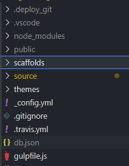
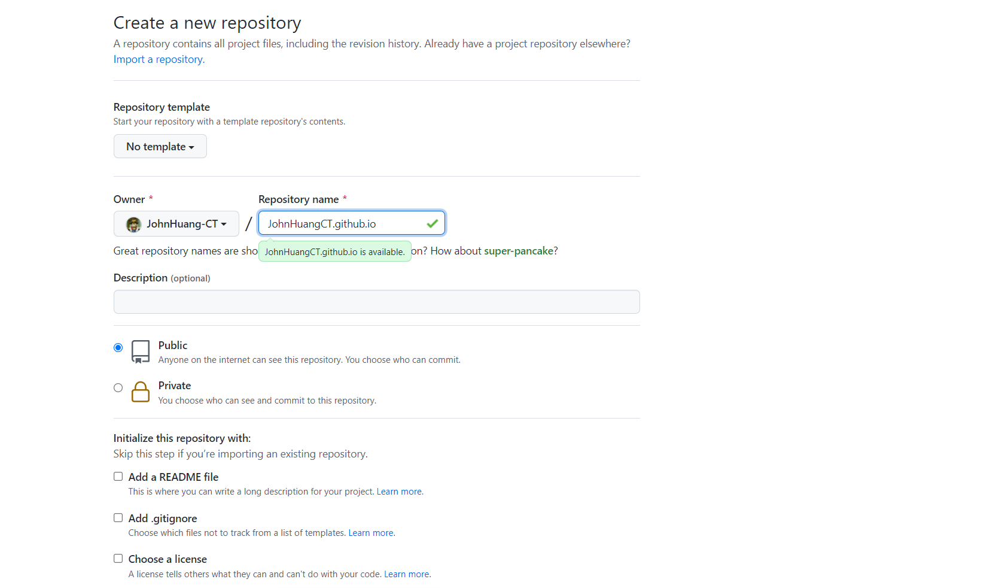
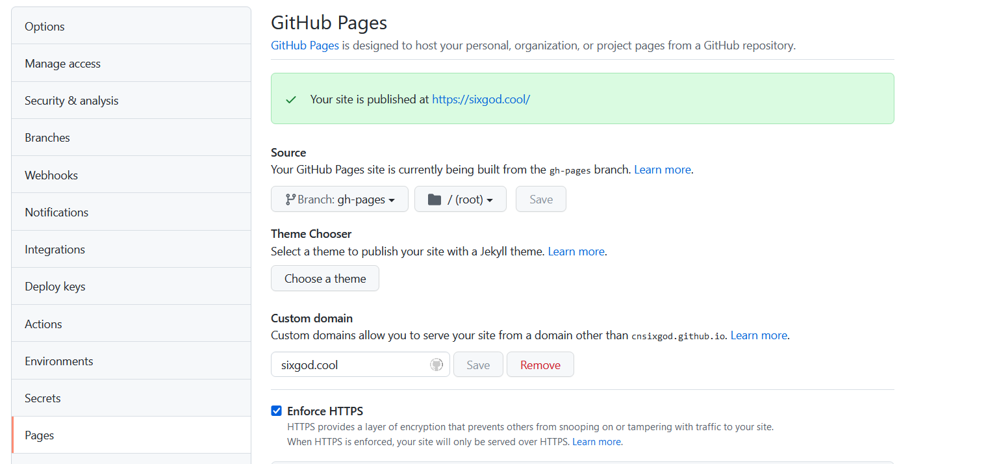

## 本地安装 `hexo`

> 本地需要有node环境 [here](https://nodejs.org/zh-cn/download/)

```javascript
npm i hexo -g

hexo init xxx
```



```javascript
scaffolds：命令生成文章等的模板
source：用命令创建的各种文章
themes：主题
_config.yml：整个博客的配置
db.json：source解析所得到的
package.json：项目所需模块项目的配置信息
```

本地运行

```javascript
hexo serve // or hexo s  命令都可以缩写
```

look at `http://localhost:4000`

## github pages

> 需要一个github账号，然后添加ssh （不懂可以google）


新建`repo`, 仓库名为`name.github.io`

> 注意：有两种类型的 `github pages`，一种是使用 `用户名.github.io` 作为项目名，一种是使用其它名称。虽然看起来只是名字不一样，但两种方式其实是有差异的，前一种方式里，网页静态文件只能存放在 master 分支，所以如果想要把博客源文件也存到同一个仓库，必须使用其它分支来存放，相应的 travis ci 监听和推送的分支也需要修改，当然也可以使用另一个新的仓库来存放。后一种方式则没这个限制，通常使用名为 `gh-pages` 作为分支名，`Hexo` 内默认设置的分支也是叫这个名字。这里我们使用的是后一种方案，即源文件和生成的网页静态文件存放在同一个仓库，源文件在 `master` 分支，静态文件在 `gh-pages` 分支。



1. 初始化 git， 进入刚创建的hexo项目目录 与远端仓库建立连接（或者`git clone`下来`repo` 然后直接重新创建一个新的hexo）
2. 然后创建一个新的本地分支 `gh-pages`，并关联远程分支（一定要是**gh-pages** ）
3. 开启 github pages， 选择 `gh-pages`分支



4. 修改hexo配置文件（`_config.yml`）

```js
deploy:
  type: git
  repo:  https://github.com/xxxx.git
  branch: master
```

5. 安装`hexo-deployer-git`

```js
npm install hexo-deployer-git --save

hexo clean     //删除上次打包
hexo generate   //打包
hexo deploy    /上传
```

打开网址就可以看到博客了`https://用户名.github.io/项目名/`

##  travis ci

> “工程化” "自动化" 是你必经之路，懒惰=进步

我们只需要将本地修改的文件推送到 `github` 仓库，就会触发 `travis ci` 的自动部署

1. 把*_config.yml*文件里的*repo*信息注释一下，不需要在配置文件里指定仓库地址，`travis ci` 会直接在其监听项目上进行部署。

```yml
deploy:
  type: 'git'
#  repo: git@github.com:MFrank2016/breeze-blog
  branch: gh-pages
```

2. 创建一个名为 `.travis.yml` 的文件，与 `_config.yml` 要在同级目录

```yml
# .travis.yml
sudo: false
language: node_js
node_js:
  - 12
cache: npm
branches:
  only:
    - master # build master branch only
script:
  - hexo generate
deploy:
  provider: pages
  skip-cleanup: true
  github-token: $GH_TOKEN
  keep-history: true
  on:
    branch: master
  local-dir: public
```

[travi ci](https://app.travis-ci.com) github 登陆 关联开启相关repo

设置travi ci 环境变量 key为GH_TOKEN  value为github 的 access token

这部分不懂的可以google一下

## ending

ok! finish

