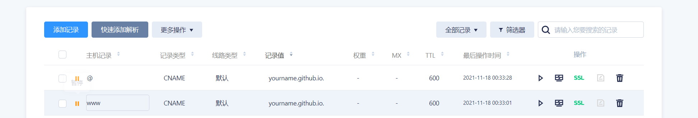
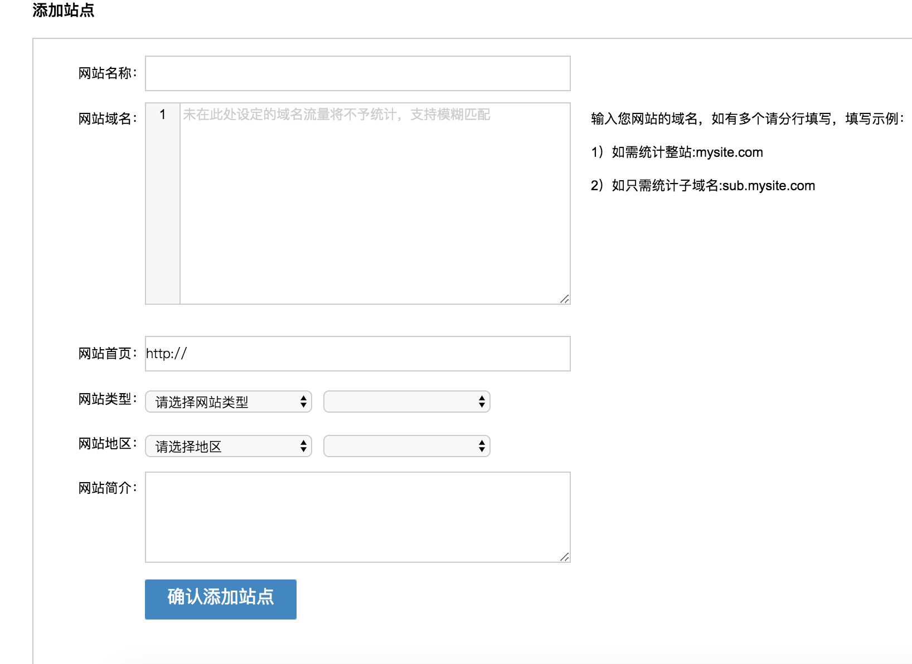
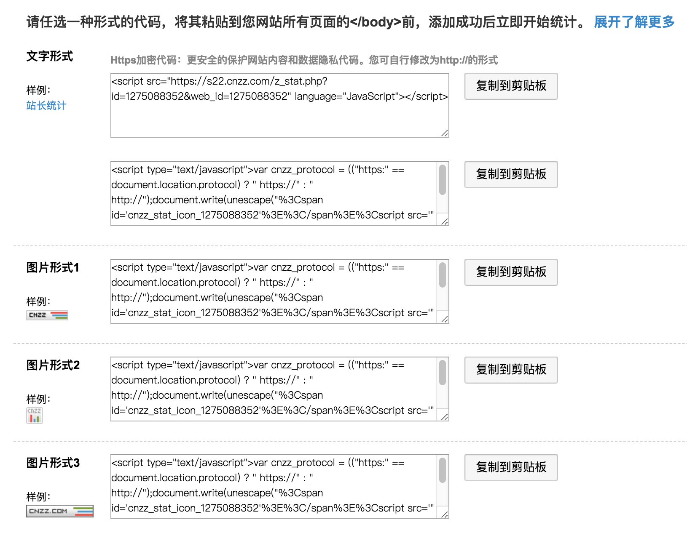
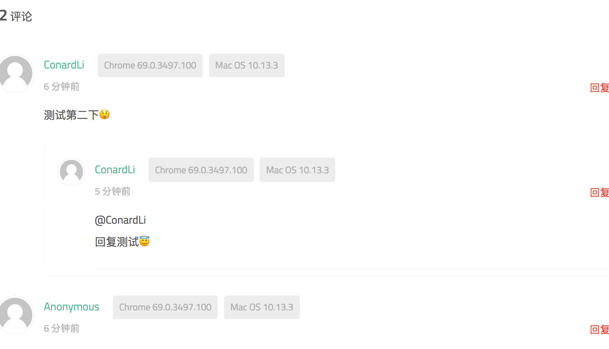
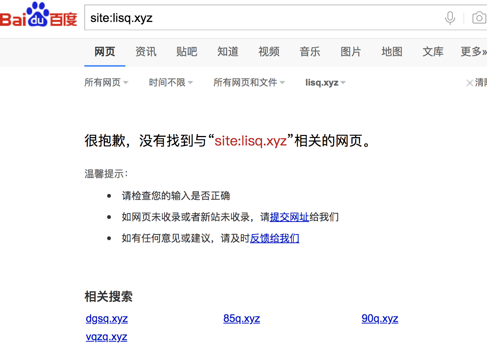
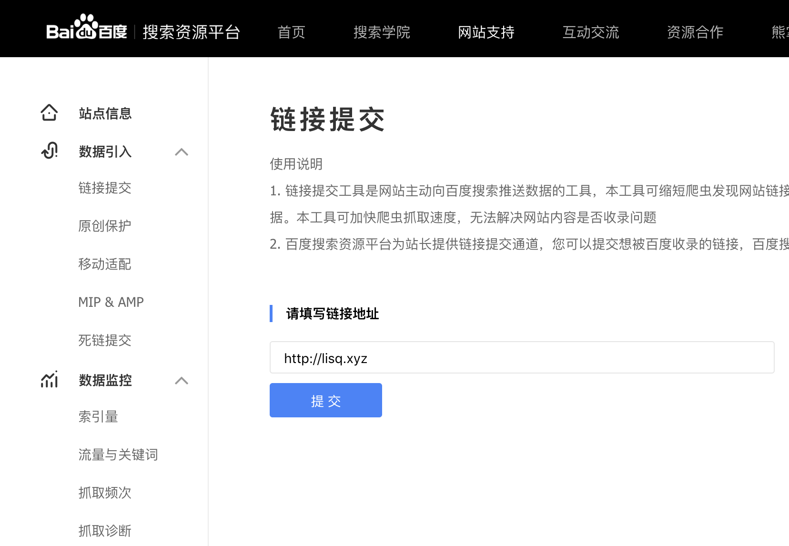
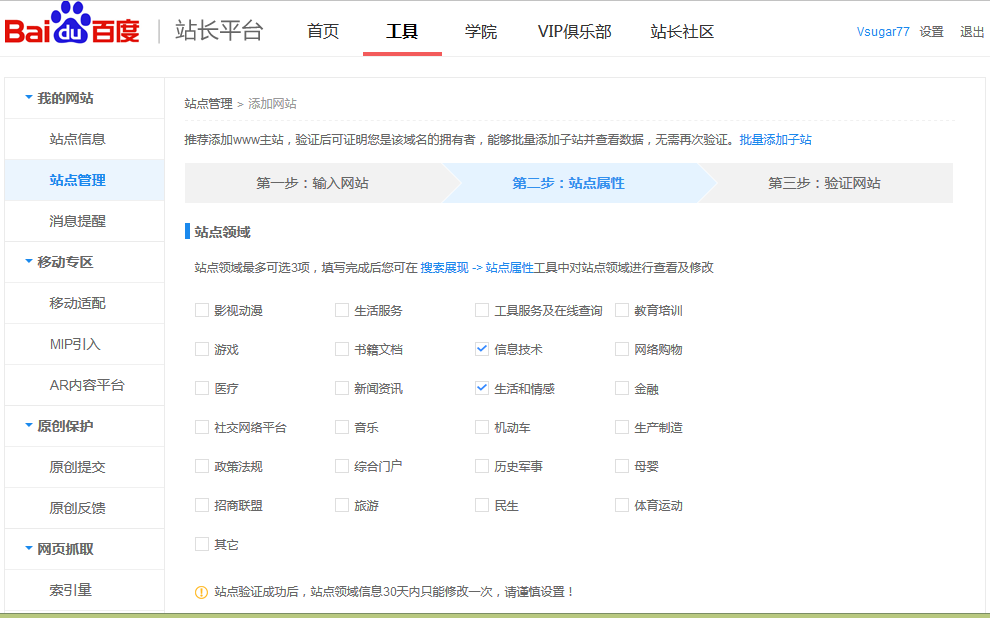
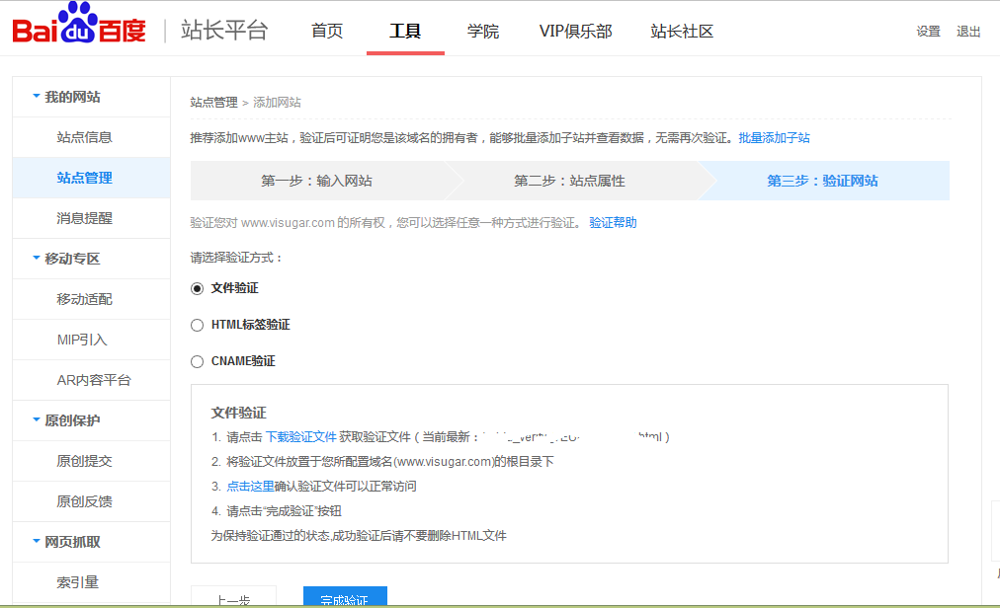
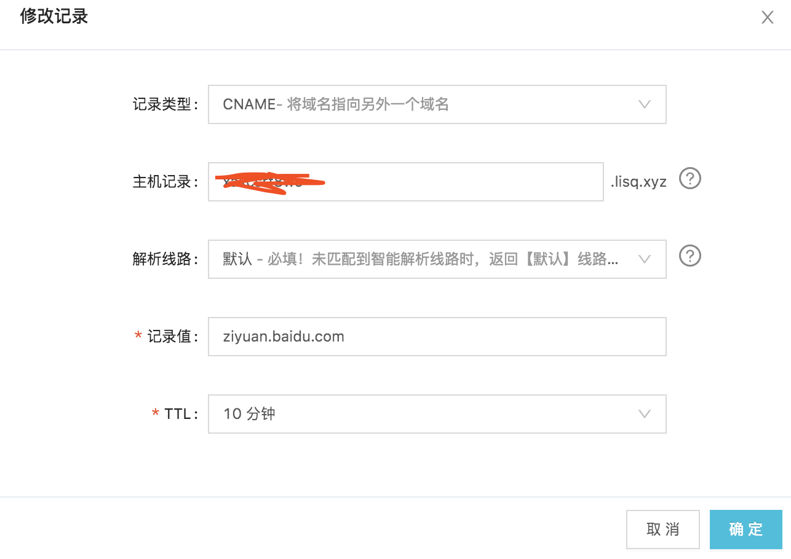
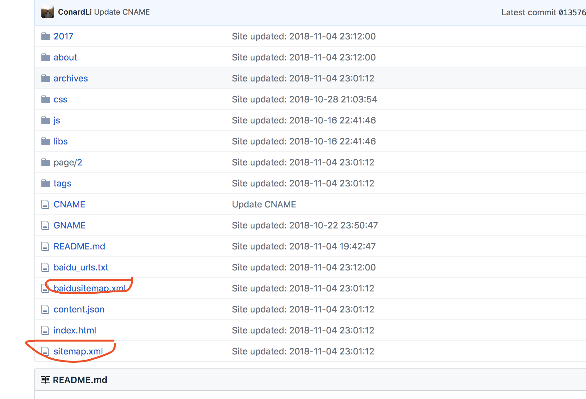

## 绑定域名

> 买个域名 以腾讯云为例

域名解析



### hexo 设置

在本地的博客目录中找到 source 文件夹。

新建一个没有后缀名的文件 GNAME

在文件中添加你的域名，如：

```text
sixgod.cool
```

保存后重新生成，并提交你的博客。

### 在 github 中找到你的博客仓库。

点击`Seeting`

找到`Custom domain`

输入你的域名点击 save

## 站长统计

1.注册一个账号。

2.添加网站。

按照如下要求添加网站



3.选择统计代码

添加完网站后就可以选择一段代码插入你的博客里了， CNZZ 提供了几种样式，你可以选择展示真实的统计数量，一个 cnzz 图标或者什么都不显示。



## 评论

博客使用 valine 作为评论工具，原因是他使用简介，体积轻量，灵活配置，速度很快！



## 数据管理

valine 接住了 LeanCloud 的力量，所以需要 LeanCloud 的 APP ID 和 APP Key

首先注册和登录 LeanCloud

创建一个应用：

应用创建好以后，进入刚刚创建的应用，选择左下角的设置>应用 Key，然后就能看到你的 APP ID 和 APP Key 了

## SEO 优化 [details](https://cloud.tencent.com/developer/article/1858762)

在搜索引擎中输入 site:<域名>,如果如下图所示就是说明我们的网站并没有被百度收录。我们可以直接点击下面的“网址提交”来提交我们的网站



然后点击途中的提交网址



选择站点的相关属性：



接下来进行网站验证，推荐使用第三种 GNAME 验证，简单快捷，只需要给你的链接增加一条解析即可:





接下来要让你的网站生成网站地图，及生产 sitemap，将 sitemap 提交到百度，先安装地图生成插件：

```text
npm install hexo-generator-sitemap --save
npm install hexo-generator-baidu-sitemap --save
```

注意根目录的\_config.yml 将 url 配置成你的站点

```text
# URL
## If your site is put in a subdirectory, set url as 'http://yoursite.com/child' and root as '/child/'
url: https://lisq.xyz/
root: /
```

重新部署博客后就会生成两个新文件 sitemap.xml 和 baidusitemap.xml



点击链接提交

使用主动推送

主动推送 安装插件 npm install hexo-baidu-url-submit --save 然后再根目录的配置文件中新增字段

```text
baidu_url_submit:
  count: 100
  host: https://lisq.xyz/
  token: 8OGYpxowYnhgVsUM
  path: baidu_urls.txt # 文本文档的地址
```

在加入新的 deploye

```text
deploy:
 - type:baidu_url_submitter
```
